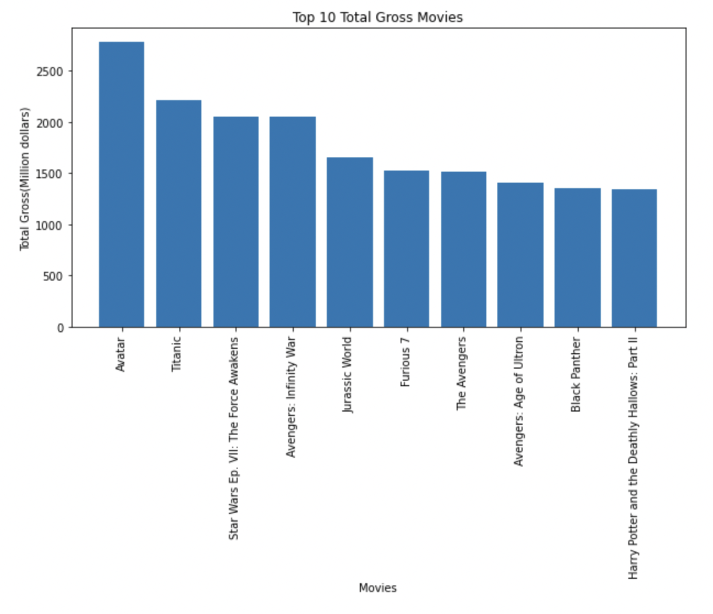
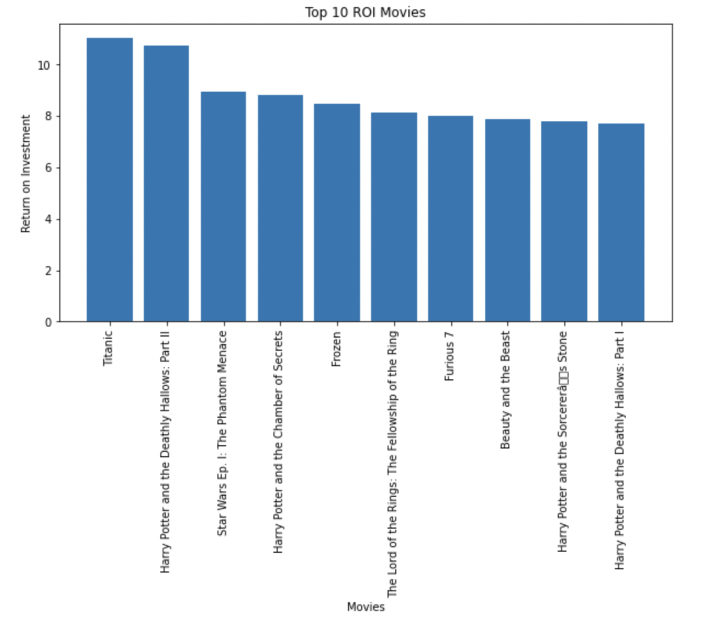
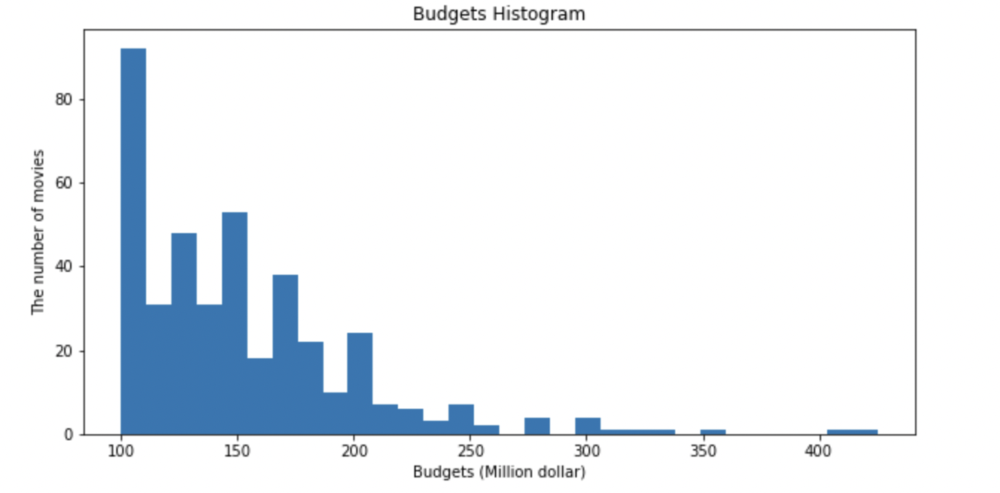

{
 "cells": [
  {
   "cell_type": "markdown",
   "metadata": {},
   "source": [
    ""
   ]
  },
  {
   "cell_type": "markdown",
   "metadata": {},
   "source": [
    "# Microsoft studio needs movie analysis\n",
    "\n",
    "**Authors:** Yeonjae Zhang, Caleb\n",
    "***"
   ]
  },
  {
   "cell_type": "markdown",
   "metadata": {},
   "source": [
    "## Overview\n",
    "\n",
    "This analysis is made for suggesting mircosoft studio the goals and business directions. With numbers and vote data, I will figure out which movies were successful and recommand business directions from historical data."
   ]
  },
  {
   "cell_type": "markdown",
   "metadata": {},
   "source": [
    "## Business Problem\n",
    "Microsoft is willing to create original video content and they want to do successful business. They have decided to create a new movie studio, but they don't know anything about creating movies. I will give them guide with exploring what types of film are currently doing the best at the box office. I have to translate those findings into actionable insights that the head of Microsoft's new movie studio can use to help decide what type of films to create.\n"
   ]
  },
  {
   "cell_type": "markdown",
   "metadata": {},
   "source": [
    "## Data\n",
    "\n",
    "TheNumbers has the longest running dataset of Numbers for money from the popular movies in world-wide. And TheMovieDB has the largest dataset of the popularity. The data files will provide movie-budgets, gross-income, and vote-average of each of movies.\n"
   ]
  },
  {
   "cell_type": "markdown",
   "metadata": {},
   "source": [
    "### Methods\n",
    "This projects uses the descriptive analysis with historical movie data. This provides useful overview of suggestions and business goals for microsoft studio."
   ]
  },
  {
   "cell_type": "markdown",
   "metadata": {},
   "source": [
    "## Results"
   ]
  },
  {
   "cell_type": "markdown",
   "metadata": {},
   "source": [
    "Most of the movies are high CG, Action and Magic Movies."
   ]
  },
  {
   "cell_type": "markdown",
   "metadata": {},
   "source": [
    "\n",
    ""
   ]
  },
  {
   "cell_type": "markdown",
   "metadata": {},
   "source": [
    "Most movies’s budget ranges are located from 100 to 200 million dollars."
   ]
  },
  {
   "cell_type": "markdown",
   "metadata": {},
   "source": [
    ""
   ]
  },
  {
   "cell_type": "markdown",
   "metadata": {},
   "source": [
    "More than 6 vote average can explain whether your movie is successful."
   ]
  },
  {
   "cell_type": "markdown",
   "metadata": {},
   "source": [
    ""
   ]
  },
  {
   "cell_type": "markdown",
   "metadata": {},
   "source": [
    "## Conclusions\n",
    "This analysis leads to three recommendations for developing movies for best expected profits:\n",
    "\n",
    "* **Suggestion for choosing movie kinds from top 10 movies selection from the market.** There are top 10 movies from the market choice. Most of the movies are high level CG action and magic movies.\n",
    "* **Analysis of budgets that most movies spend.**  I suggest to use the budgets from 100 to 200 million dollars, that most movies spent. That's because the budgets don't have correlation with ROI. \n",
    "* **Get the goals with vote average.** Most movies have vote average from 5 to 8 rating. If your movie fits in this goal, market tell you 'your movie is successful.'\n"
   ]
  }
 ],
 "metadata": {
  "kernelspec": {
   "display_name": "Python 3 (ipykernel)",
   "language": "python",
   "name": "python3"
  },
  "language_info": {
   "codemirror_mode": {
    "name": "ipython",
    "version": 3
   },
   "file_extension": ".py",
   "mimetype": "text/x-python",
   "name": "python",
   "nbconvert_exporter": "python",
   "pygments_lexer": "ipython3",
   "version": "3.8.12"
  }
 },
 "nbformat": 4,
 "nbformat_minor": 4
}
